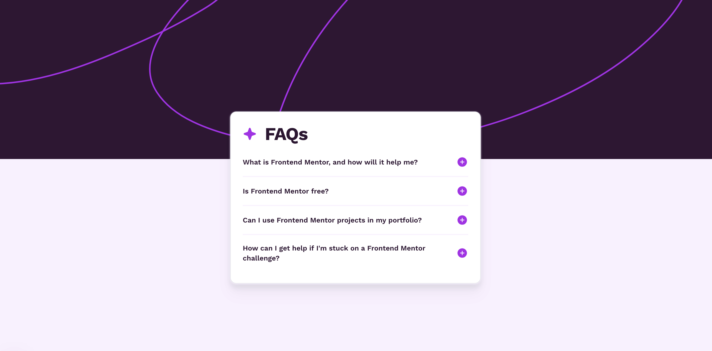

# Frontend Mentor - Faq section

## The challenge

The challenge is inspired by Frontend Mentor https://www.frontendmentor.io/challenges/faq-accordion-wyfFdeBwBz.
It's a simple FAQ component written in Next.js

## Demo

<a href="https://faq-section-4un9.vercel.app/" target="_blank">https://faq-section-4un9.vercel.app/</a>
